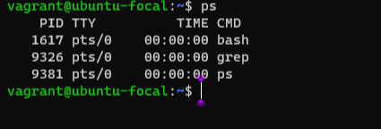
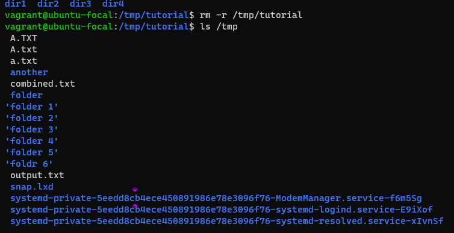
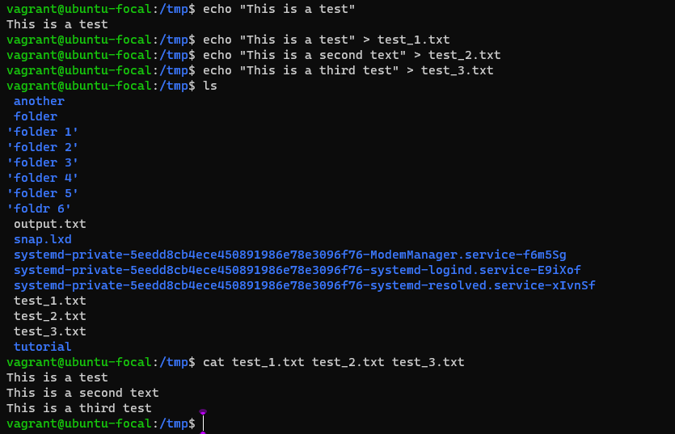
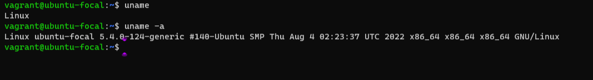
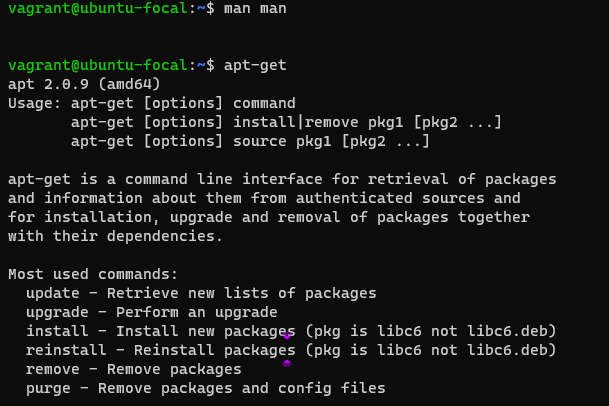
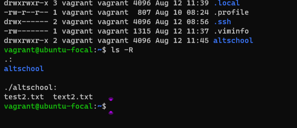
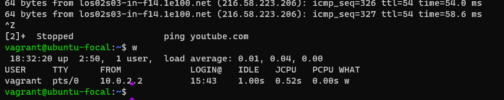
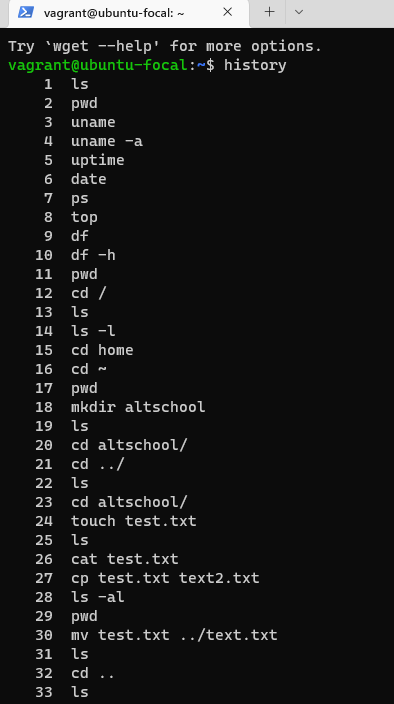
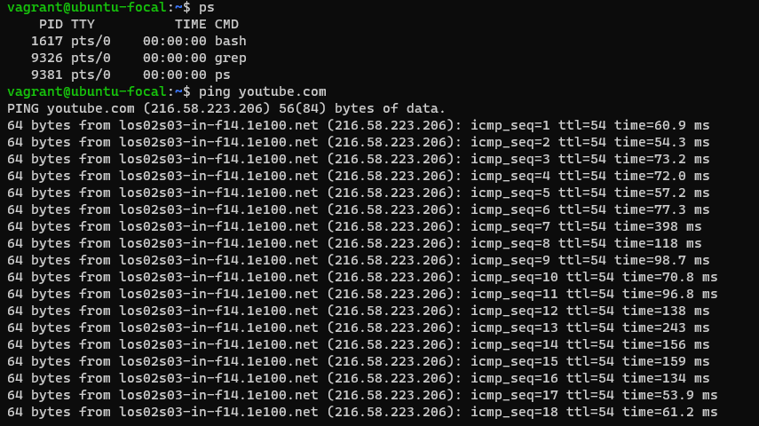
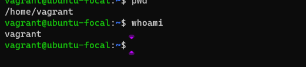

# TASK
Research online for 10 more linux commands

# List of Linux commands
- ps command

The ps command is called the process status. to get the list of processes, we run `-ps` command.

- rm command

The `rm` command is called remove. the remove command is used to remove specific file from a directory. 
Using `rm -r` the flag "-r" is used when removing the complete directories. 

- echo command

The `echo` command just as the name implies prints the arguments back out again. but combines it with a redirect.

- uname command

The `uname` command can be used to get the release number, version of linux, and much more. 
Using `uname -a` the flag "-a" is used to get detailed information.

- apt-get

The `apt-get` command is used to install and update packages.

- ls -R 

The `ls -R` command is used to print subdirectories of a directory.

- ls -a

The `ls -a` command is used to get the hidden files.

 

- w 

The `w` command is used to display the user details that are currently logged into the system. 

- history

The `history` command shows the list of commands (with numeric numbers) executed. 

- ping 

The `ping` command is used to check the connectivity to server. the command will ping to the particular server and also prints the response time.

- whoami

The `whoami` command reminds the user of the username, incase the user is not sure. 

