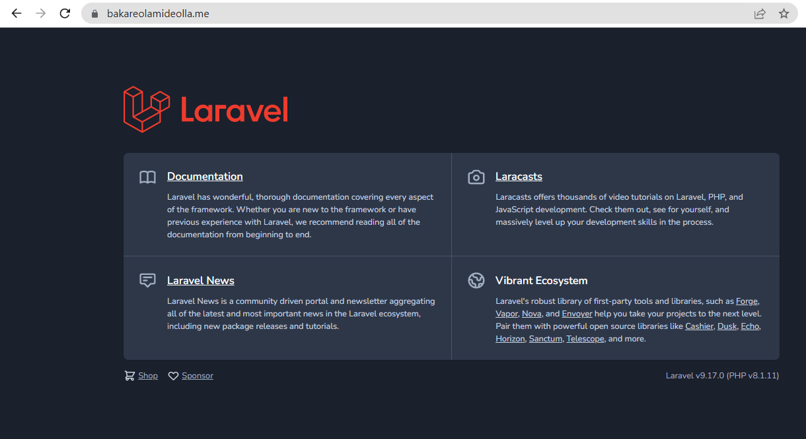

**MINI PROJECT**

We will be deploying a real life application:

- Demo Project: https://github.com/f1amy/laravel-realworld-example-app

- Setup Debian 11 on a virtual machine instance with a cloud provider or as instructed

- Setup Apache with every dependency the application needs to run

- Don't use Laravel Sail or Docker as suggested in the project README filw, simply clone the project with Git and deploy with Apache

- Setup MySQL with credentials and a database for your application to use

- COnfigure a subdomain if you have a domain name to point to the VM instance or speak to an instructor for further guide

- You have completed the project if you are able to view the application according to the specification in the project from your Host browser

**Procedures:**

- Set up virtual machine running debian 11 using a cloud provider

Install LAMP (Apache, MySQL, Php 8.1) on debian 11

Install Git, Wget, Curl, Composer

- Update the package installer

run 

      sudo su 
      
      apt update

- Install the following packages (Apache2, Wget, Git, Curl)

run 

      apt install -y wget git apache2 curl

- Install PHP 

run 
                      
      apt -y install lsb-release apt-transport-https ca-certificates

      wget -O /etc/apt/trusted.gpg.d/php.gpg https://packages.sury.org/php/apt.gpg

      echo "deb https://packages.sury.org/php/ $(lsb_release -sc) main" | sudo tee /etc/apt/sources.list.d/php.list

update the packages and install PHP 8.1

run

      apt update

      apt install php libapache2-mod-php php8.1-mysql php8.1-common php8.1-mysql php8.1-xml php8.1-xmlrpc php8.1-curl php8.1-gd php8.1-imagick php8.1-cli php8.1-dev php8.1-imap php8.1-mbstring php8.1-opcache php8.1-soap php8.1-zip php8.1-intl -y

      php -v

- Install mySQL

run

      apt update

      wget https://dev.mysql.com/get/mysql-apt-config_0.8.22-1_all.deb

      apt update

      apt install ./mysql-apt-config_0.8.22-1_all.deb

      apt update

      apt install mysql-server

      mysql -u root

      ALTER USER 'root'@'localhost' IDENTIFIED BY 'yourNewPass';

      service mysql status

- Create a Database

run 

      mysql -u root -p

      CREATE DATABASE yourdatabase;

- Install Laravel 8 Using Comppser

run 

      cd /var/www/

      mkdir "NewFolder"

      cd "NewFolder"

      git clone https://github.com/f1amy/laravel-realworld-example-app.git

      mv laravel-realworld-example-app laravel

      cd laravel 

- Create a copy of your .env file   

run

       cp .env.example .env

       nano .env

       chown -R www-data:www-data /var/www/altschool/laravel

       chmod -R 775 /var/www/altschool/laravel
       
       chmod -R 775 /var/www/altschool/laravel/storage

       chmod -R 775 /var/www/altschool/laravel/bootstrap/cache

- Install Composer

run

        curl -sS https://getcomposer.org/installer | php

        mv composer.phar /usr/local/bin/composer

        chmod +x /usr/local/bin/composer

        composer --version

        Composer version 2.4.3 2022-10-14 17:11:08

-  Install Composer Dependencies

run

        composer install

        php artisan key:generate

        nano /etc/apache2/sites-available/altschool.conf

-  Configure Apache to Host Laravel 8

run

         nano /etc/apache2/sites-available/altschool.conf

         a2enmod rewrite

         a2ensite altschool.conf

Finally, reload the Apache service to apply the changes

run     
         systemctl restart apache2

         nano /etc/hosts

- Access Laravel

run

         cd /var/www/altschool/laravel/routes

Uncomment the block of codes with the "route"

         <?php

           use Illuminate\Support\Facades\Route;

           /*
           |--------------------------------------------------------------------------
           | Web Routes
           |--------------------------------------------------------------------------
           |
           | Here is where you can register web routes for your application. These
           | routes are loaded by the RouteServiceProvider within a group which
           | contains the "web" middleware group. Now create something great!
           |
           */

           /*Route::get('/', function () {
           return view('welcome');
           });*/

- Rendered Page

    