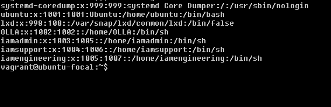

# TASK

## Create 3 groups – admin, support & engineering and add the admin group to sudoers. 
- run command `groupadd admin` to create an admin group. but note that an admin group is already existing by default. 
- run command `groupadd support` to create a support group. 
- run command `groupadd engineering` to create an engineering group. and if you get prompts like permission denied. 
- run command `sudo groupadd "name of group"`to create the groups respectiviely. 
- run command `sudo tail /etc/group` or `sudo cat /etc/group`. to double-check the created groups or view where they are stored. tail shows less details. while cat shows the full details 

- run command `sudo visudo /etc/sudoers` to add the admin group to sudoers. but note that the admin group already existed. so in the sudoers file modified the admin group in the members of the admin group using %admin ALL=(ALL:ALL) ALL

## Create a user in each of the groups. 
- run command `sudo useradd -g admin -m -s /usr/bin/bash "name of user"`to create a user and have the user belonging to the particular group. 
- run command `sudo tail /etc/group` or `sudo cat /etc/group`. to double-check the created groups or view where they are stored.

## Generate SSH keys for the user in the admin group
- run command `sudo su - "admin user name"` to switch name to the admin user.
- run command `ssh-keyen` to generate ssh keys for the user in the admin group. 

# INSTRUCTION

## Submit the contents of /etc/passwd, /etc/group, /etc/sudoers

- /etc/passwd

- /etc/group

- /etc/sudoers

