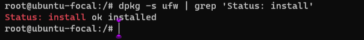
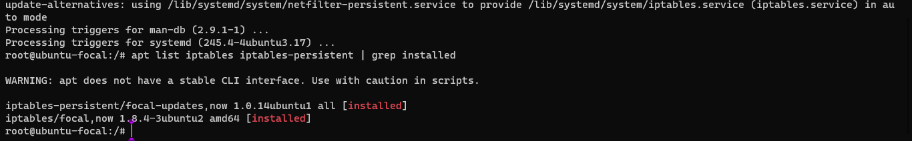
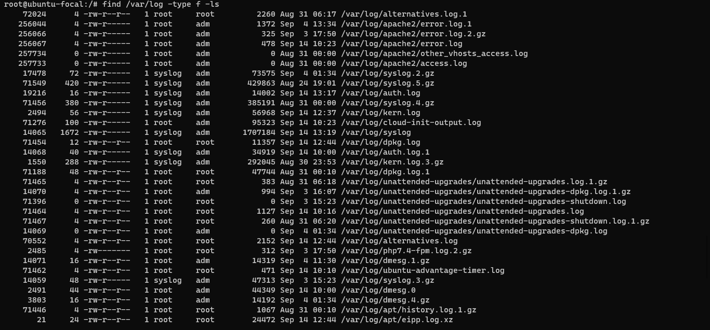
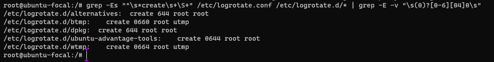
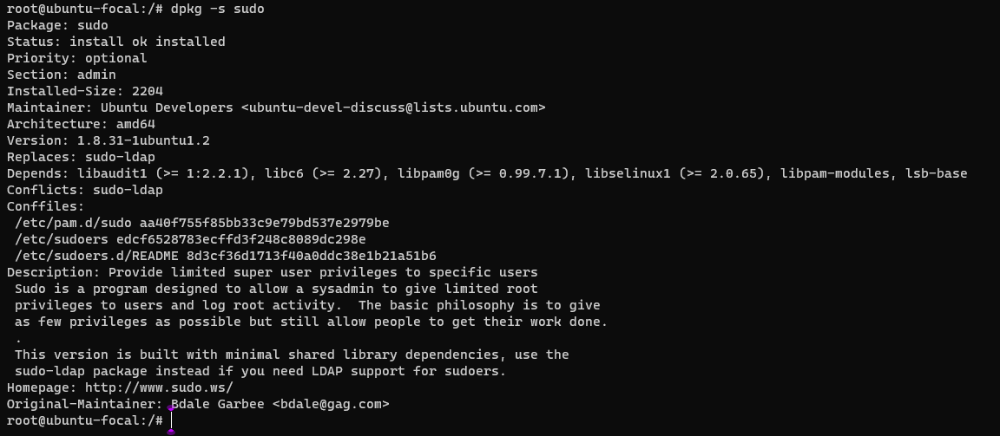

# TASK:
- Review the CIS benchmark for ubuntu and try to implement at least 10 of the recommendations that has been made within the benchmark.

# RECOMMENDATIONS, IMPLEMENTATIONS AND OUTPUTS FOR SECURITY HARDENING FOR UBUNTU 20.04. 

# Recommendations

- Disable Automounting (Automated)
- Ensure authentication required for single user mode (Automated)
- Ensure DNS Server is not installed (Automated)
- Ensure talk client is not installed (Automated)
- Ensure ufw is installed (Automated)
- Ensure iptables packages are installed (Automated) 
- Ensure permissions on all logfiles are configured (Automated)
- Ensure logrotate assigns appropriate permissions (Automated)
- Ensure sudo is installed (Automated)
- Ensure permissions on /etc/ssh/sshd_config are configured (Automated)

# Implementations and Outputs 

# 1. Initial Setup

## 1.1 Filesystem Configuration:

The directories that are used for system-wide functions can be further protected by placing them on separate partitions. This provides protection for resource exhaustion and enables the use of mounting options that are applicable to the directory's intended use.

## 1.1.23 Disable Automounting (Automated)

Profile Applicability:
- Level 1 - Server
- Level 2 - Workstation

Description:
autofs allows automatic mounting of devices, typically including CD/DVDs and USB drives.

Rationale:
With automounting enabled anyone with physical access could attach a USB drive or disc and have its contents available in system even if they lacked permissions to mount it themselves.

Impact:
The use of portable hard drives is very common for workstation users. If your organization allows the use of portable storage or media on workstations and physical access controls to workstations is considered adequate there is little value add in turning off automounting.

Audit:
autofs should be removed or disabled. 

Run this command `# dpkg -s autofs` to verify that autofs is not installed or is disabled.

Output should include: 

package `autofs` is not installed

my output:

## 1.4.4 Ensure authentication required for single user mode (Automated)

Profile Applicability:
- Level 1 - Server
- Level 1 - Workstation

Description:
Single user mode is used for recovery when the system detects an issue during boot or by manual selection from the bootloader.

Rationale:
Requiring authentication in single user mode prevents an unauthorized user from rebooting the system into single user to gain root privileges without credentials.

Audit:

Perform the following to determine if a password is set for the root user:

`# grep -Eq '^root:\$[0-9]' /etc/shadow || echo "root is locked"`

No results should be returned.

my output:

# 2. Services

## 2.1 Special Purpose Services

This describes services that are installed on systems that specifically need to run these services. If any of these services are not required, it is recommended that they be deleted from the system to reduce the potential attack surface. If a package is required as a dependency, and the service is not required, the service should be stopped and masked.

## 2.1.8 Ensure DNS Server is not installed (Automated)

Profile Applicability:
- Level 1 - Server
- Level 1 - Workstation

Description:

The Domain Name System (DNS) is a hierarchical naming system that maps names to IP addresses for computers, services and other resources connected to a network.

Rationale:

Unless a system is specifically designated to act as a DNS server, it is recommended that the package be deleted to reduce the potential attack surface.

Audit:

Run the following command to verify DNS server is not installed:

`# dpkg -s bind9 | grep -E '(Status:|not installed)'`

my output:

## 2.2 Service Clients

A number of insecure services exist. While disabling the servers prevents a local attack against these services, it is advised to remove their clients unless they are required.

## 2.2.3 Ensure talk client is not installed (Automated)

Profile Applicability:
- Level 1 - Server
- Level 1 - Workstation

Description:

The talk software makes it possible for users to send and receive messages across systems through a terminal session. The talk client, which allows initialization of talk sessions, is installed by default.

Rationale:

The software presents a security risk as it uses unencrypted protocols for communication.

Impact:

Many insecure service clients are used as troubleshooting tools and in testing environments. Uninstalling them can inhibit capability to test and troubleshoot. If they are required it is advisable to remove the clients after use to prevent accidental or intentional misuse.

Audit:

Verify talk is not installed. The following command may provide the needed information:

`# dpkg -s talk | grep -E '(Status:|not installed)'`

my ouput:

# 3. Network Configuration

This provides guidance on for securing the network configuration of the system through kernel parameters, access list control, and firewall settings.

## 3.5 Firewall Configuration

A firewall is a set of rules. When a data packet moves into or out of a protected network space, its contents (in particular, information about its origin, target, and the protocol it plans to use) are tested against the firewall rules to see if it should be allowed through

## 3.5.1.1 Ensure ufw is installed (Automated)

Profile Applicability:

- Level 1 - Server
- Level 1 - Workstation

Description:

The Uncomplicated Firewall (ufw) is a frontend for iptables and is particularly well-suited for host-based firewalls. ufw provides a framework for managing netfilter, as well as a command-line interface for manipulating the firewall

Rationale:

A firewall utility is required to configure the Linux kernel's netfilter framework via the iptables or nftables back-end.
The Linux kernel's netfilter framework host-based firewall can protect against threats originating from within a corporate network to include malicious mobile code and poorly configured software on a host.

Note: Only one firewall utility should be installed and configured. UFW is dependent on the iptables package

Audit:

Run the following command to verify that Uncomplicated Firewall (UFW) is installed: 

`# dpkg -s ufw | grep 'Status: install'`

my output:

## 3.5.3.1.1 Ensure iptables packages are installed (Automated)

Profile Applicability:

- Level 1 - Server
- Level 1 - Workstation

Description:

iptables is a utility program that allows a system administrator to configure the tables provided by the Linux kernel firewall, implemented as different Netfilter modules, and the chains and rules it stores. Different kernel modules and programs are used for different protocols; iptables applies to IPv4, ip6tables to IPv6, arptables to ARP, and ebtables to Ethernet frames.

Rationale:

A method of configuring and maintaining firewall rules is necessary to configure a Host Based Firewall.

Audit:

Run the following command to verify that iptables and iptables-persistent are installed: 

`# apt list iptables iptables-persistent | grep installed`

my output:

# 4. Logging and Auditing

## 4.2 Configure Logging

Logging services should be configured to prevent information leaks and to aggregate logs on a remote server so that they can be reviewed in the event of a system compromise and ease log analysis.

## 4.2.3 Ensure permissions on all logfiles are configured (Automated)

Profile Applicability:

- Level 1 - Server
- Level 1 - Workstation

Description:

Log files stored in /var/log/ contain logged information from many services on the system, or on log hosts others as well.

Note: You may also need to change the configuration for your logging software or services for any logs that had incorrect permissions.

Rationale:

It is important to ensure that log files have the correct permissions to ensure that sensitive data is archived and protected.

Audit:

Run the following command and verify that other has no permissions on any files and group does not have write or execute permissions on any files: 

`# find /var/log -type f -ls`

my output:

## 4.4 Ensure logrotate assigns appropriate permissions (Automated)

Profile Applicability:

- Level 1 - Server
- Level 1 - Workstation

Description:

Log files contain logged information from many services on the system, or on log hosts others as well.

Rationale:

It is important to ensure that log files have the correct permissions to ensure that sensitive data is archived and protected.

Audit:

Run the following command: 

`# grep -Es "^\s*create\s+\S+" /etc/logrotate.conf /etc/logrotate.d/* | grep -E -v "\s(0)?[0-6][04]0\s"`

my output:

# 5. Access, Authentication and Authorization

## 5.2 Configure sudo

sudo allows a permitted user to execute a command as the superuser or another user, as specified by the security policy. The invoking user's real (not effective) user ID is used to determine the user name with which to query the security policy.
sudo supports a plugin architecture for security policies and input/output logging. Third parties can develop and distribute their own policy and I/O logging plugins to work seamlessly with the sudo front end. The default security policy is sudoers, which is configured via the file /etc/sudoers.

## 5.2.1 Ensure sudo is installed (Automated)

Profile Applicability:
- Level 1 - Server
- Level 1 - Workstation

Description:

sudo allows a permitted user to execute a command as the superuser or another user, as specified by the security policy. The invoking user's real (not effective) user ID is used to determine the user name with which to query the security policy.

Note: Use the sudo-ldap package if you need LDAP support for sudoers

Rationale:

sudo supports a plugin architecture for security policies and input/output logging. Third parties can develop and distribute their own policy and I/O logging plugins to work seamlessly with the sudo front end. The default security policy is sudoers, which is configured via the file /etc/sudoers.
The security policy determines what privileges, if any, a user has to run sudo. The policy may require that users authenticate themselves with a password or another authentication mechanism. If authentication is required, sudo will exit if the user's password is not entered within a configurable time limit. This limit is policy-specific.

Audit:

Verify that sudo in installed. Run the following command and inspect the output to confirm that sudo is installed: 

`# dpkg -s sudo`

my output:

## 5.3.1 Ensure permissions on /etc/ssh/sshd_config are configured (Automated)

Profile Applicability:

- Level 1 - Server
- Level 1 - Workstation

Description:

The /etc/ssh/sshd_config file contains configuration specifications for sshd. The command below sets the owner and group of the file to root.

Rationale:

The /etc/ssh/sshd_config file needs to be protected from unauthorized changes by non-privileged users.

Audit:

Run the following command and verify Uid and Gid are both 0/root and Access does not grant permissions to group or other: 

`# stat /etc/ssh/sshd_config`

my output:

