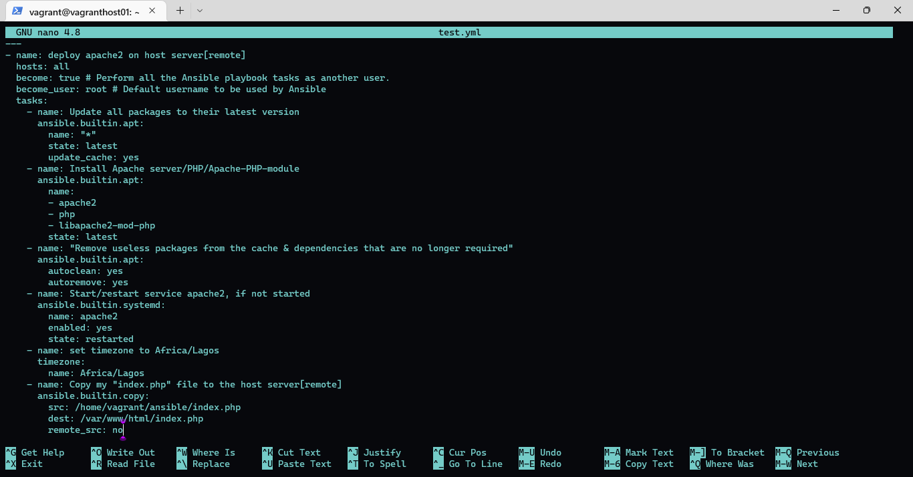
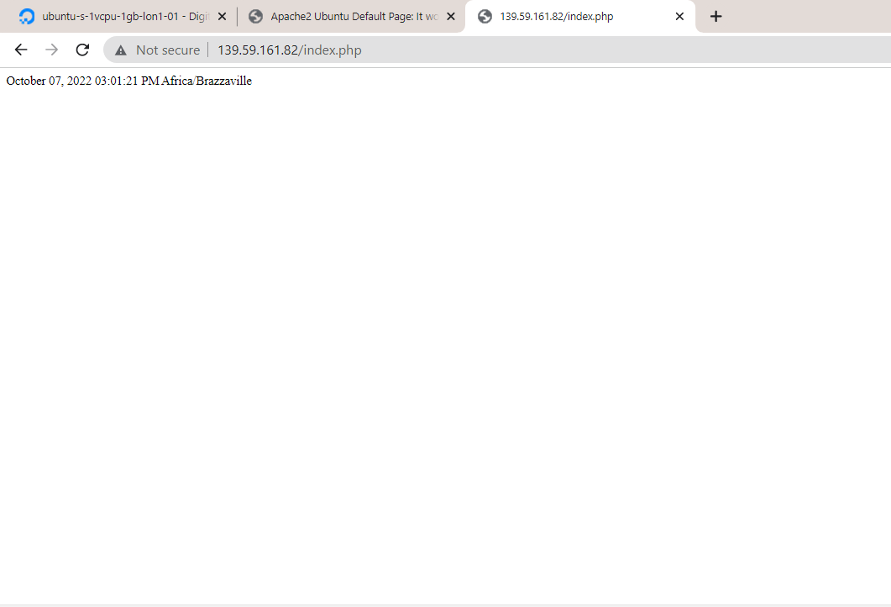

## Task:

Create an Ansible Playbook to setup a server with Apache.
The server should be set to the Africa/Lagos Timezone

Host an index.php file with the following content, as the main file on the server:

`<?php
date("F d, Y h:i:s A e", time());
?>`

## Instruction:

Submit the Ansible playbook, the output of systemctl status apache2 after deploying the playbook and a screenshot of the rendered page

## Procedure:

- Install ansible along with software properties and python.

run

`sudo get-apt install -y software-properties-common python-apt`

`sudo get-apt install -y ansible`

- Create ssh key and Generated ssh key  

run `ssh-keygen`

run `cat ~/.ssh/id_rsa.pub`

- Process to digitalocean.com and Create a server. 

copy your generated ssh key and import the contents of the public key into the public key contents text box in digitalocean and processes to create a droplet.

- create a folder by the name ansible and cd into it. then run `ansible-playbook -h` to test if ansible has been installed.

- Create a host file. run `touch "name of host inventory"`

- Create an index.php file `run nano index.php` and place the php details provided above in the task.

- Create a playbook to install apache, set time zone to Africa/Lagos, install php and run a test to double check

run `ansible all -i host-inventory -m ping`

run `ansible-playbook test.yml -i host-inventory`

- Double Check the result in the target machine to see if the installations were deployed, and check the apache service to confirm it is working fine.

- Run the rendered page on browser. 

**Ansible playbook**

**Output of systemctl of apache status**

**Rendered page**

