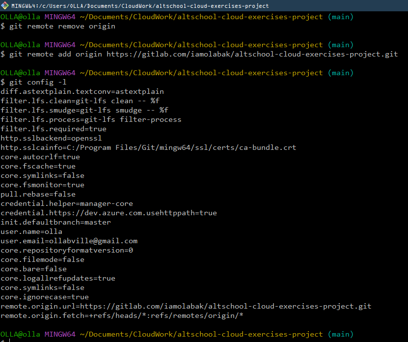
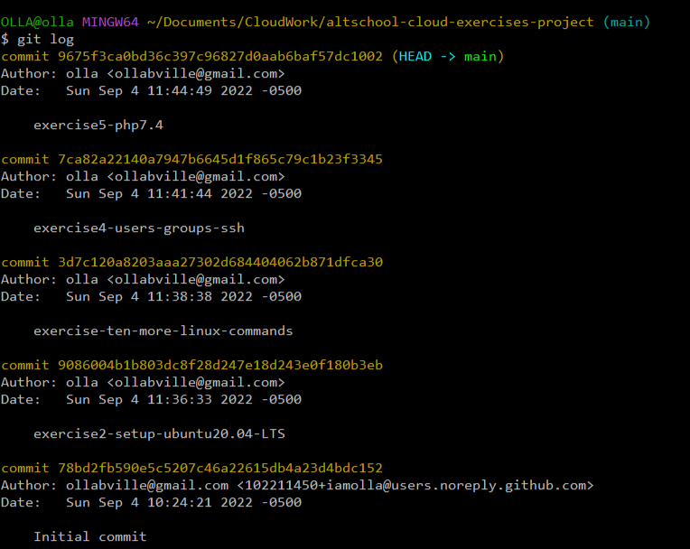

# TASK

- You already have Github account, aso setup a GitLab account if you don’t have one already

- You already have a altschool-cloud-exercises project, clone the project to your local system

- Setup your name and email in Git’s global config

## Steps:

- Open https://gitlab.com to set up a gitlab account and follow the process

- Open https://github.com to set up a githup account and follow the process

- copy the url link generated and clone it to your local system. 
  
- run `git clone "paste url"`to clone to your local system

- run `git config --global user.name "username"` to set up your username

- run `git config --global user.email "useremail"` to set up your email

# INSTRUCTION

- Submit the output of:
- git config -l
- git remote -v
- git log

#### run `git config -l` 

#### run `git remote -v`

#### run `git log`

