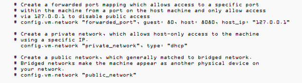
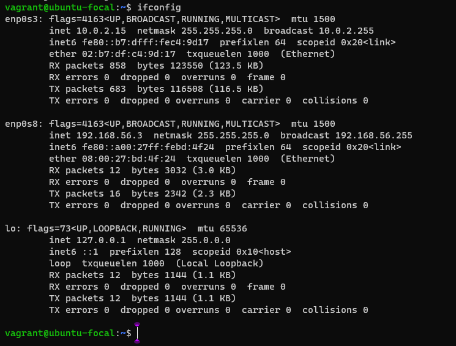

# TASK: 
Setup Ubuntu 20.04 LTS on your local machine using Vagrant

# INSTRUCTION: 
Customize your Vagrantfile as necessary with private_network set to dhcp.
Once the machine is up, run ifconfig and share your output in your submission
along with your Vagrantfile in a folder for this exercise

# REQUIREMENTS:
- Virtualbox,
- Virtualbox Extension Pack,
- Vagrant,
- Linux Ubuntu 20.04 LTS/focal64 (Host Operating System),
- Enable virtualization in the system BIOS.

# PROCEDURE:
- Install Virtualbox,
- Install Virtualbox Extensions Pack,
- Install Vagrant, 
- `run vagrant -v` to double-check the version of Vagrant installed,
- `run vagrant init` ubuntu20.04 LTS/focal64 to initialize Vagrant and a Vagrant file is generated,
- `run vagrant up` to the start VM,
- `run vagrant ssh` to connect to Virtual Machine,
- Customize your Vagrantilefile as necessary with private_network set to dhcp,

- Install net-tools Using `sudo apt install net-tools`,
- `Run ifconfig` to generate the output of the network adapters.
